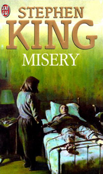

# stephen King

## Présentation

Né le 21 septembre 1947 à *Portland* dans le Maine, est un écrivain __américain__.

Il publie son premier roman en __1974__ et devient rapidement célèbre pour ses contributions dans le domaine de l'horreur mais écrit également des livres relevant d'autres genres comme le __fantastique__, la __fantasy__, la __science-fiction__ et le __roman policier__. Tout au long de sa carrière, il écrit et publie plus de *soixante* romans, dont **sept** sous le nom de plume de __Richard Bachman__, et plus de deux cents nouvelles, dont plus de la moitié sont réunies dans douze recueils de nouvelles. Après son grave accident en __1999__, il ralentit son rythme d'écriture. Ses livres se sont vendus à plus de 350 millions d'exemplaires à travers le monde et il établit de nouveaux records de ventes dans le domaine de l'édition durant les années 1980, décennie où sa popularité atteint son apogée.

## Carrière

En *1972*, alors que __Stephen King__ a 25 ans, il entreprend la rédaction de __Carrie__, l'histoire d'une adolescente souffre-douleur de ses camarades de classe qui développe un pouvoir de télékinésie, mais, doutant de la qualité de son récit, il jette les premières pages à la poubelle. __Tabitha__ les retrouve et, après les avoir lues, encourage son mari à persévérer dans sa tentativel. __King__ termine donc Carrie et expédie le manuscrit à la maison d'édition __Doubleday__.

## Vie Privée

__Stephen King__ vit avec sa femme __Tabitha__ qu'il a épousée le *2 janvier 1971* et avec laquelle il a eu trois enfants prénommés __Naomi__(née le *1er juin 1971*), __Joe__ (né le *4 juin 1972*) et __Owen__ (né le *21 février 1977*), les deux derniers étant également écrivains.

## Style littéraire

La principale qualité de __Stephen King__, reconnue même par ses détracteurs les plus acharnés, est son sens de la narration, son talent de conteur capable de captiver le lecteur à travers une histoire rendue très rapidement intéressante. Ses personnages vivants et colorés, qui prennent une identité bien définie en quelques phrases, et son aisance à susciter la frayeur en frappant l'imagination de ses lecteurs, font également partie de ses forces en tant qu'écrivain. Le réalisme de ses personnages et des situations qui les introduisent sont d'ailleurs un facteur déterminant dans sa réussite à faire accepter par ses lecteurs l'irruption de l'horreur.

